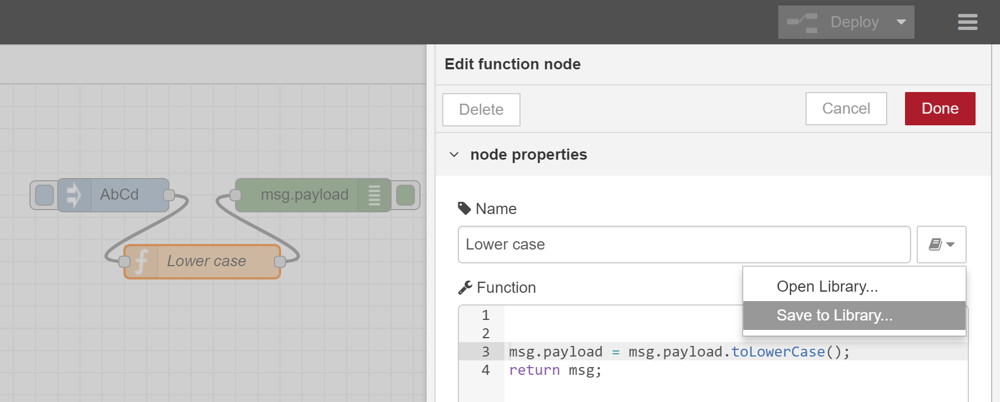

Node generator
----
Node generator is command line tool to generate Node-RED node modules from several various sources including Swagger specification and function node's source.
Using this tool, node developers can dramatically reduce their time to implement Node-RED node modules.

## Use cases
Node-RED is useful for rapid development without coding using existing nodes on flow library.
On the other hand, once Node-RED users develop their original nodes to realize custom processing, JavaScript and HTML coding will be time consuming task.
To solve the problem, Node generator generates original node without coding and packages it.
There are four types of use case for Node generator.

#### (1) Connection to cloud services
http request node can easily connect to cloud services via REST API.
But in terms of marketing, instead of http request node, original node for the cloud services will be effective to increase the number of users because details of node properties, node information and documents will contribute to usability.
In general, cloud service providers publish Swagger definition with REST API for users to test it on Swagger UI.
Node generator uses this Swagger definition to create nodes for connection to cloud service.
Therefore, cloud service providers can release their original nodes without node development cost.

#### (2) Reuse of function node as original node
Node-RED users use function node to write simple handling with JavaScript code.
But sometimes they tend to add many JavaScript codes into function node when they gradually improve their flow with try and error style development.
If this function node has useful functionality, reuse of the function node for other Node-RED users will be the best decision because other users do not need to create same functionality and are able to concentrate on the development of their other flow.
In this case, Node generator supports development of original node from existing function node.

#### (3) Reuse of subflow as original node (future functionality)
In terms of reuse, the unit of subflow is suitable for sharing with other Node-RED users.
In the future, Node generator will support functionality for creating original node from subflow.
Node-RED users can encapsulate their flow as original nodes.
For example, both template node which has authentication header and http request node which has URL is a typical pair which a lot of Node-RED users use to connect to cloud services.
Node generator can generate original nodes from subflow which has the flow.
And Node-RED users can easily share their original nodes with other Node-RED users via flow library.

#### (4) Connection to devices (future functionality)
Web of Things (WoT) is standard specification to connect IoT devices.
Node generator will support Web of Things description to create original nodes.
Currently, there are [a slide](https://github.com/w3c/wot/blob/master/plugfest/2018-bundang/images/Plugfest-Bundang-WoT.pdf) and [screenshot](https://github.com/w3c/wot/blob/master/plugfest/2018-bundang/result-hitachi.md) of the prototype implementation on GitHub.

## How to use Node generator
To install Node generator to local environment, users need to input the following "npm install" command on command prompt (Windows) or terminal (macOS/Linux).
Because the command execution needs root permission, "sudo" is required before "npm install" command on macOS or Linux environment.

    npm install -g node-red-nodegen

Current version of node generator supports function node and Swagger definition as source file.
Simply, Node generator command, node-red-nodegen converts to node the file which is specified in argument of command as follows.

    node-red-nodegen <source file> -> The command tool outputs the node from the source file

The following documentations explains details of method to create node from two types of source file.

 - [How to create node from Swagger definition](#how-to-create-node-from-swagger-definition)
 - [How to create node from function node](#how-to-create-node-from-function-node)

## Generated files which node package contains
The following is typical directory structure of node package generated by Node generator.
After generating the node, Node-RED users can install it to local Node-RED environment or publish it on flow library without additional development.

    - node.js         <- JavaScript file for node processing
    - node.html       <- HTML file for node property UI
    - icons
       |-icon.png     <- Icon file for node
    - package.json    <- node package information
    - README.md       <- Explanation file for node package
    - LICENSE         <- License information of node
    - test
       |-node_spec.js <- Test case for node
    - locales
       |-en-US
          |-node.json <- Message catalog for English language
       |-ja
          |-node.json <- Message catalog for Japanese language
       |-zh-CN
          |-node.json <- Message catalog for Chinese language
       |-de-DE
          |-node.json <- Message catalog for German language

## How to create node from Swagger definition
You can specify URL or file path of Swagger definition as the first argument of node-red-nodegen command.

(1) Generate node using node-red-nodegen command

    node-red-nodegen http://petstore.swagger.io/v2/swagger.json

Node-RED users typically import generated node to pallet of Node-RED flow editor using the following procedures.

(2) Change directory to generated node's directory

    cd node-red-contrib-swagger-petstore

(3) Prepare symbolic link

    sudo npm link

(4) Change current directory to Node-RED home directory (Typically, Node-RED home directory is ".node-red" under home directory)

    cd ~/.node-red

(5) Create symbolic link

    npm link node-red-contrib-swagger-petstore

(6) Start Node-RED

    node-red

After starting Node-RED, you can see generated node on palette of Node-RED flow editor.
If you want to customize generated node, the following procedures and command line options will be helpful.

#### Module name
Node generator uses "node-red-contrib-" as default prefix of module name.
Therefore, module name is "node-red-contrib-swagger-petstore" when node name is "swagger-petstore".
If you want to change the default module name, you can specify module name using --module or --prefix option.

    node-red-nodegen http://petstore.swagger.io/v2/swagger.json --module node-red-node-swagger-petstore
    node-red-nodegen http://petstore.swagger.io/v2/swagger.json --prefix node-red-node

#### Node name
In the case of node generated from Swagger definition, "info.title" value in Swagger definition is used as generated node's name.
Node generator will replace upper case characters and spaces with hyphen to convert appropriate name for npm module and Node-RED node.

##### Example of swagger definition
```
{
  "swagger": "2.0",
  "info": {
    "description": "This is a sample server Petstore server.",
    "version": "1.0.0",
    "title": "Swagger Petstore",  <- Node generator converts this value to "swagger-petstore" and uses it as node name.
    "license": {
      "name": "Apache 2.0",
      "url": "http://www.apache.org/licenses/LICENSE-2.0.html"
    }
  },
  "host": "petstore.swagger.io",
  "basePath": "/v2",
  ...
}
```

If you want to change the default name, you can set node name using --name option.
Especially, user needs to specify node name using --name option when "info.title" value contains a double-byte character instead of alphabet and number because Node generator cannot create node correctly.

    node-red-nodegen ~/.node-red/lib/function/lower-case.js --name new-node-name

#### Version
As the default, Node generator uses "info.version" value as the module version number.

##### Example of swagger definition
```
{
  "swagger": "2.0",
  "info": {
    "description": "This is a sample server Petstore server.",
    "version": "1.0.0",  <- Node generator uses this version number as the module version number.
    "title": "Swagger Petstore",
    "license": {
      "name": "Apache 2.0",
      "url": "http://www.apache.org/licenses/LICENSE-2.0.html"
    }
  },
  "host": "petstore.swagger.io",
  "basePath": "/v2",
  ...
}
```

When you update the version number of module without incrementation of swagger definition version number, you need to specify --version option.
Especially, conflict error will occur when you publish the module which has same version number as previous published module using "npm publish" command.
In this case, the --version option need to be specified to update the version number of module.

    node-red-nodegen http://petstore.swagger.io/v2/swagger.json --version 0.0.2

#### Keywords
--keywords is useful option for keywords of module on flow library.
On flow library website, visitors will search the module using the keywords.
For example, if you want use "petstore" as a keyword, you can specify the word using --keywords option.
As the default, node generator uses "node-red-nodegen" as keyword.

    node-red-nodegen http://petstore.swagger.io/v2/swagger.json --keywords petstore

To add more than two keywords, you can also use comma separated keywords.

    node-red-nodegen http://petstore.swagger.io/v2/swagger.json --keywords petstore,petshop

When "--keywords node-red" is specified before publishing the generated node, your node will be registered on flow library and you can install the node via Node-RED flow editor.

    node-red-nodegen http://petstore.swagger.io/v2/swagger.json --keywords petstore,petshop,node-red

#### Category
On palette of Node-RED flow editor, generated node is in function category as the default.
To change the category or use product name, you can use --category option.
For example, the generated node which the following command outputs will be in "analysis" category on Node-RED flow editor.

    node-red-nodegen http://petstore.swagger.io/v2/swagger.json --category analysis

#### Node icon
Currently, node generator does not support --icon option to specify icon file for generated node.
Therefore, you need to change icon file manually.
(--icon option will be supported in the future version of Node generator)
Because the default icon file is in "icons/icon.png", you need to overwrite the icon file.

    mv new-icon.png node-red-contrib-swagger-petstore/icons/icon.png

As official documentation explains, icon should have white on a transparent background.
And icon size should also be 20 x 30.

#### Node color
Current version of node generator does not also support --color option to specify color of the generated node.
Because of that, you need to modify color setting of generated node manually.
(--color option will be supported in the future version of Node generator)

    vi node-red-contrib-swagger-petstore/node.html

```html:
<script type="text/javascript">
    RED.nodes.registerType('swagger-petstore', {
        category: 'function',
        color: '#89bf04',    <- Change this value if you want to change node color.
        defaults: {
            method: { value: "" },
            ...
```

"RED.nodes.registerType()" has color setting, "color:"#C0DEED"".
To change the node's color, you need to change "#C0DEED" to other hexadecimal numbers which represent node's color.

#### Node's information in info tab
Node generator automatically generates node's information in info tab using following values in Swagger definition.

- info.description : Node description
- paths.[path].[http method].summary : Method description
- paths.[path].[http method].operationId : Method name

##### Example of swagger definition
```
{
  "swagger": "2.0",
  "info": {
    "description": "This is a sample server Petstore server.",  <- Node generator uses this value as the node description.
    "version": "1.0.0",
    "title": "Swagger Petstore",
    "license": {
      "name": "Apache 2.0",
      "url": "http://www.apache.org/licenses/LICENSE-2.0.html"
    }
  },
  "host": "petstore.swagger.io",
  "basePath": "/v2",
  ...
  "paths": {
    "/pet": {
      "post": {
        "tags": [
          "pet"
        ],
        "summary": "Add a new pet to the store",  <- Node generator uses this value as the method description.
        "description": "",
        "operationId": "addPet",  <- Node generator uses this value as the method name.
  ...
}
```

If you want to modify node information in info tab, you can manually edit node's HTML file at the end of section.

    vi node-red-contrib-swagger-petstore/node.html

```html:
<script type="text/x-red" data-help-name="swagger-petstore">

    <p>This is a sample server Petstore server.</p>   <- Modify the node description
    <h2>Methods</h2>
        <h3>addPet</h3>                               <- Modify the method name
        <h4>Add a new pet to the store</h4>           <- Modify the method description
        ...
        <h3>deleteUser</h3>
        <h4>This can only be done by the logged in user.</h4>
</script>
```

#### README
To explain details of node, you need to write documentation in README.md file.
The documentation will be used in flow library web site if you publish your node on flow library.
Because node generator outputs template of README.md, you just modify the file.

    vi node-red-contrib-swagger-petstore/README.md

```
node-red-contrib-swagger-petstore
=====================

Node-RED node for swagger-petstore

This is a sample server Petstore server.

Install
-------

Run the following command in your Node-RED user directory - typically `~/.node-red`

        npm install node-red-contrib-swagger-petstore
```

#### Test cases
Test cases are the most important to maintain the quality of generated node in production use.
Node generator outputs template file of test cases into the file, "test/node_spec.js" under generated directory.
You need to modify three lines, (1),(2) and (3) in the test case file.
If Swagger definition does not contain host name in "info" value, you need to write host name as (4) in each test case manually.

    vi node-red-contrib-swagger-petstore/test/node_spec.js

```JavaScript:
    it('should handle addPet()', function (done) {
        var flow = [
            { id: 'n1', type: 'swagger-petstore', name: 'swagger-petstore',
                method: 'addPet',
                addPet_body: '<node property>', // (1) define node properties
                wires: [['n3']]
            },
            { id: 'n3', type: 'helper' }
        ];
        helper.load(node, flow, function () {
            var n3 = helper.getNode('n3');
            var n1 = helper.getNode('n1');
            n3.on('input', function (msg) {
                try {
                    msg.should.have.property('payload', { "id": 4513 }); // (3) define output message
                    done();
                } catch (e) {
                    done(e);
                }
            });
            n1.receive({ payload: { "id": 4513 } }); // (2) define input message
        });
    });
```

In this example, the generated node send data, "{ "id": 4513 }" to pet store REST API.
And then, REST API returns same data, "{ "id": 4513 }".
Therefore, input and output messages are same.
You can run the test cases using "npm test" command under the generated directory.

    cd node-red-contrib-swagger-petstore
    npm install
    npm test

#### Message catalogs
As default, Node generator outputs template files of English, Japanese, Chinese and German languages.
When you want to support internationalization of node properties, you need to add language messages of parameters into the files.

    vi node-red-contrib-swagger-petstore/locales/ja

```
{
    "SwaggerPetstore": {
        "label": {
            "service": "サービス",
            "method": "メソッド",
            "host": "ホスト",
            "header": "ヘッダ",
            "value": "値",
            "isQuery": "クエリ"
        },
        "status": {
            "requesting": "要求中"
        },
        "parameters": {
            "addPet": "addPet",
            "body": "body",
            "updatePet": "updatePet",
            "findPetsByStatus": "findPetsByStatus",
            ...
            "optionalParameters": "任意項目"
        }
    }
}
```

If your node does not support some languages, you can delete the language directory.
(For example, delete "zh-CN" directory, if you do not want to support Chinese language)

## How to create node from function node
After writing JavaScript code in function node, you can export the JavaScript code as js file using "Save to Library..." menu in function node.
Because node generator uses function node name as generated node's name, it is better to input node name before exporting the function node.
Node-RED saves the js file to the directory, "<Home directory>/.node-red/lib/functions/".
Therefore, you need to specify the directory and file path as the argument of command line.

(1) Export function node as js file



(2) Generate node using node-red-nodegen command

    node-red-nodegen ~/.node-red/lib/function/lower-case.js

Node-RED users typically import generated node to pallet of Node-RED flow editor using the following procedures.

(3) Change current directory to generated node's directory

    cd node-red-contrib-lower-case

(4) Prepare symbolic link

    sudo npm link

(5) Change directory to Node-RED home directory (Typically, Node-RED home directory is ".node-red" under home directory)

    cd ~/.node-red

(6) Create symbolic link

    npm link node-red-contrib-lower-case

(7) Start Node-RED

    node-red

After starting Node-RED, you can see generated node on palette of Node-RED flow editor.
If you want to customize generated node, the following procedures and command line options will be helpful.

#### Module name
Node generator uses "node-red-contrib-" as default prefix of module name.
Therefore, module name is "node-red-contrib-lower-case" when node name is "lower-case".
If you want to change the default module name, you can specify module name using --module or --prefix option.

    node-red-nodegen ~/.node-red/lib/function/lower-case.js --module node-red-node-lower-case
    node-red-nodegen ~/.node-red/lib/function/lower-case.js --prefix node-red-node

#### Node name
In the case of function node, node name in function node is used as generated node's name.
If you want to change the default name, you can set node name using --name option.

    node-red-nodegen ~/.node-red/lib/function/lower-case.js --name new-node-name

#### Version
As the default, the version number of module is always "0.0.1".
When you update the version number of module, you need to specify --version option.
Especially, conflict error will occur when you publish the module which has same version number as previous published module using "npm publish" command.
In this case, the --version option need to be specified to update the version number of module.

    node-red-nodegen ~/.node-red/lib/function/lower-case.js --version 0.0.2

#### Keywords
--keywords is useful option for keywords of module on flow library.
On flow library website, visitors will search the module using the keywords.
For example, if you want use "lower-case" as a keyword, you can specify the word using --keywords option.
As the default, node generator uses "node-red-nodegen" as keyword.

    node-red-nodegen ~/.node-red/lib/function/lower-case.js --keywords lower-case  

To add more than two keywords, you can also use comma separated keywords.

    node-red-nodegen ~/.node-red/lib/function/lower-case.js --keywords lower-case,function

When "--keywords node-red" is specified before publishing the generated node, your node will be registered on flow library and you can install the node via Node-RED flow editor.

    node-red-nodegen ~/.node-red/lib/function/lower-case.js --keywords lower-case,function,node-red

#### Category
On palette of Node-RED flow editor, generated node is in function category as the default.
To change the category or use product name, you can use --category option.
For example, the generated node which the following command outputs will be in "analysis" category on Node-RED flow editor.

    node-red-nodegen ~/.node-red/lib/function/lower-case.js --category analysis

#### Node icon
Currently, node generator does not support --icon option to specify icon file for generated node.
Therefore, you need to change icon file manually.
(--icon option will be supported in the future version of Node generator)
Because the default icon file is in "icons/icon.png", you need to overwrite the icon file.

    mv new-icon.png node-red-contrib-lower-case/icons/icon.png

As official documentation explains, icon should have white on a transparent background.
And icon size should also be 20 x 30.

#### Node color
Current version of node generator does not also support --color option to specify color generated node.
Because of that, you need to modify color setting of generated node manually.
(--color option will be supported in the future version of Node generator)

    vi node-red-contrib-lower-case/node.html

```html:
<script type="text/javascript">
    RED.nodes.registerType('lower-case',{
        color:"#C0DEED",
        category: 'function',
        defaults: {
            name: {value:""},
        },
        inputs:1,
        outputs: 1,
        icon: "icon.png",
        label: function() {
            return this.name || 'lower-case';
        }
    });
</script>
```

"RED.nodes.registerType()" has color setting, "color:"#C0DEED"".
To change the node's color, you need to change "#C0DEED" to other hexadecimal numbers which represent node's color.

#### Node's information in info tab
Node generator outputs template of node information into node.html file.
You need to modify the template along with your node.
(Node developer will be able to use node description property to use node information in the future version of Node-RED and node generator)

    vi node-red-contrib-lower-case/node.html

```html:
<script type="text/x-red" data-help-name="lower-case">
    <p>Summary of the node.</p>
    <h3>Inputs</h3>
    <dl class="message-properties">
       <dt>payload<span class="property-type">object</span></dt>
       <dd>Explanation of payload.</dd>
       <dt class="optional">topic <span class="property-type">string</span></dt>
       <dd>Explanation of topic.</dd>
    </dl>
    <h3>Outputs</h3>
    <dl class="message-properties">
        <dt>payload<span class="property-type">object</span></dt>
        <dd>Explanation of payload.</dd>
        <dt class="optional">topic<span class="property-type">string</span></dt>
        <dd>Explanation of topic.</dd>
    </dl>
    <h3>Details</h3>
    <p>Explanation of the details.</p>
    <p><b>Note</b>: Note of the node.</p>
</script>
```

In the template, there are summary of node and three sections.
Inputs section has properties information of inputted messages.
Outputs section has properties explanation of outputted messages.
Details section will contain additional information of the generated node.

#### README
To explain details of node, you need to write documentation in README.md file.
The documentation will be used in flow library web site if you publish your node on flow library.
Because node generator outputs template of README.md, you just modify the file.

    vi node-red-contrib-lower-case/README.md

```
node-red-contrib-lower-case
=====================

Node-RED node for lower case

Install
-------

Run the following command in your Node-RED user directory - typically `~/.node-red`

        npm install node-red-contrib-lower-case
```

#### Test cases
Test cases are the most important to maintain the quality of generated node in production use.
Node generator outputs template file of test cases into the file, "test/node_spec.js" under generated directory.
You need to modify two lines, (1) and (2) in the test case file.

    vi node-red-contrib-lower-case/test/node_spec.js

```JavaScript:
    it('should have payload', function (done) {
        var flow = [
            { id: "n1", type: "lower-case", name: "lower-case", wires: [["n2"]] },
            { id: "n2", type: "helper" }
        ];
        helper.load(node, flow, function () {
            var n2 = helper.getNode("n2");
            var n1 = helper.getNode("n1");
            n2.on("input", function (msg) {
                msg.should.have.property('payload', 'abcd'); // (2) define output message
                done();
            });
            n1.receive({ payload: "AbCd" }); // (1) define input message
        });
    });
```

In this example, the generated node converts upper case characters to lower case characters.
Therefore, input message is "AbCd" and output message is "abcd".
You can run the test cases using "npm test" command under the generated directory.

    cd node-red-contrib-lower-case
    npm install
    npm test
