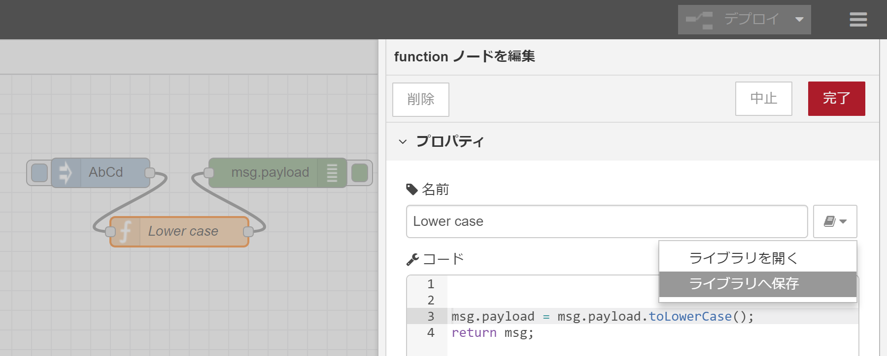

ノードジェネレータ
----
ノードジェネレータは、SwaggerやfunctionノードなどのソースコードからNode-REDのノードを生成するためのコマンドラインツールです。
このツールを使用すると、ノード開発者はNode-REDノードの実装時間を大幅に短縮できます。

<a name="use-cases"></a>
## 利用ケース
Node-REDは、フローライブラリに用意されているノードを使用し、コーディングすることなく迅速な開発ができることが利点です。
しかし、独自の処理を実現するために、Node-REDユーザがノードを開発すると、JavaScriptとHTMLのコーディングに時間がかかり、迅速な開発ができるNode-REDの利点が薄れてしまいます。
この問題を解決するために、ノードジェネレータはコーディングなしで独自のノードを自動生成し、パッケージ化します。
以下の通り、ノードジェネレータには4つの利用ケースがあります。

#### (1) クラウドサービスへの接続
httpリクエストノードは、REST API経由でクラウドサービスに簡単に接続できます。
しかし、マーケティングの観点から考えると、httpリスエストの代替として、クラウドサービス向けに専用に独自に開発したノードを公開することは、クラウドサービスのユーザ数を増やすために効果的です。
なぜなら、クラウドサービスとの接続方法を詳細に解説したのノードプロパティ、ノード情報、ドキュメントがユーザビリティに貢献するためです。
一般的に、クラウドサービスプロバイダは、ユーザーがSwagger UIでREST APIをテストできるよう、Swagger定義を公開しています。
ノードジェネレータは、このSwagger定義を使用して、クラウドサービスへの接続用のノードを生成します。
従って、クラウドサービスプロバイダーは、ノード開発コストなしで独自のノードを公開できるようになります。

#### (2) functionノードを独自のノードとして再利用
Node-REDユーザは、functionノードにJavaScriptコードを記述し、簡単な処理を動作させています。
しかし、試行錯誤を繰り返す開発を行い、フローを徐々に改善すると、大量のJavaScriptコードをfunctionノードに追加してしまうことがあります。
この時、functionノードに便利な機能が備わっている場合、他のNode-REDユーザにこのfunctionノードを共有し、再利用をしてほしいというニーズが挙がってきます。
なぜなら、ノードを再利用することで、他のNode-REDユーザは同じ機能を開発する必要がなく、フローの開発に集中できるためです。
ノードジェネレータは、この様なニーズを満たすために、既存のfunctionノードから独自のノードの開発する作業を助けます。

#### (3) サブフローを独自のノードとして再利用（将来機能）
他のNode-REDユーザーとフローを共有するには、サブフローの単位で行うのが最適です。
将来、ノードジェネレータは、サブフローから独自のノードを生成する機能をサポートします。
Node-REDユーザは、サブフローを独自のノードとしてカプセル化できるようになります。
例えば、認証ヘッダーを持つtemplateノードとURLを持つhttp requestノードは、多くのNode-REDユーザーがクラウドサービスに接続するために使用する典型的なペアです。
ノードジェネレータは、この様なフローを含むサブフローから独自のノードを生成できます。
そして、Node-REDユーザは、フローライブラリを介して、生成したノードを他のNode-REDユーザと容易に共有できます。

#### (4) デバイスへの接続（将来機能）
Web of Things（WoT）は、IoTデバイスを接続するための標準仕様です。
ノードジェネレータはWeb of Thingsの記述から独自のノードを開発することを支援します。
現在のところ、GitHub上にプロトタイプ実装の[スライド](https://github.com/w3c/wot/blob/master/plugfest/2018-bundang/images/Plugfest-Bundang-WoT.pdf)と[スクリーンショット](https://github.com/w3c/wot/blob/master/plugfest/2018-bundang/result-hitachi.md)があります。

<a name="how-to-use-node-generator"></a>
## ノードジェネレータの使い方
ノードジェネレータをローカル環境にインストールするには、コマンドプロンプト（Windows）またはターミナル（macOS / Linux）で次の「npm install」コマンドを入力します。
コマンド実行にはroot権限が必要なため、macOSまたはLinux環境では "npm install"コマンドの前に "sudo"が必要です。

    npm install -g node-red-nodegen

ノードジェネレータの現在のバージョンは、functionノードとSwagger定義をソースファイルとしてサポートしています。
ノードジェネレータのコマンド、node-red-nodegenは、以下のようにコマンドの引数で指定されたファイルをノードに変換します。

    node-red-nodegen <source file> -> コマンドツールは、ソースファイルからノードを出力します

以降のドキュメントでは、2種類のソースファイルからノードを生成する方法の詳細について説明します。

 - [Swagger定義からノードを生成する方法](#how-to-create-node-from-swagger-definition)
 - [functionノードからノードを生成する方法](#how-to-create-node-from-function-node)

<a name="generated-files-which-node-package-contains"></a>
## ノードパッケージに含まれる生成ファイル
ノードジェネレータによって自動生成されるノードパッケージの典型的なディレクトリ構造は以下の通りです。
Node-REDユーザは、自動生成されたノードをローカルNode-RED環境にインストールしたり、追加開発なくフローライブラリに公開したりできます。

    - node.js         <- ノード処理用のJavaScriptファイル
    - node.html       <- ノードプロパティUIのHTMLファイル
    - icons
       |-icon.png     <- ノードのアイコンファイル
    - package.json    <- ノードパッケージ情報
    - README.md       <- ノードパッケージの説明ファイル
    - LICENSE         <- ノードのライセンス情報
    - test
       |-node_spec.js <- ノードのテストケース
    - locales
       |-en-US
          |-node.json <- 英語のメッセージカタログ
       |-ja
          |-node.json <- Message catalog for Japanese language
       |-zh-CN
          |-node.json <- 日本語のメッセージカタログ
       |-de-DE
          |-node.json <- ドイツ語のメッセージカタログ

<a name="how-to-create-node-from-swagger-definition"></a>
## Swagger定義からノードを生成する方法
node-red-nodegenコマンドの最初の引数として、Swagger定義のURLまたはファイルパスを指定できます。

(1) node-red-nodegenコマンドを使用してノードを生成する

    node-red-nodegen http://petstore.swagger.io/v2/swagger.json

Node-REDユーザは通常、以下の手順で生成されたノードをNode-REDフローエディタのパレットにインポートします。

(2) 生成されたノードのディレクトリにディレクトリを変更する

    cd node-red-contrib-swagger-petstore

(3) シンボリックリンクを準備する

    sudo npm link

(4) カレントディレクトリをNode-REDのホームディレクトリに変更します（通常、Node-REDのホームディレクトリは、ホームディレクトリの下の".node-red"です）

    cd ~/.node-red

(5) シンボリックリンクを作成する

    npm link node-red-contrib-swagger-petstore

(6) Node-REDを起動する

    node-red

Node-REDを起動すると、Node-REDフローエディタのパレットに生成されたノードが表示されます。
生成されたノードをカスタマイズする場合は、次の手順やコマンドラインオプションが役立ちます。

#### モジュール名
ノードジェネレータは、モジュール名のデフォルトのプレフィックスとして "node-red-contrib-"を使用します。
従って、ノード名が "swagger-petstore"の場合、モジュール名は "node-red-contrib-swagger-petstore"となります。
デフォルトのモジュール名を変更したい場合は、--moduleまたは--prefixオプションを使用してモジュール名を指定できます。

    node-red-nodegen http://petstore.swagger.io/v2/swagger.json --module node-red-node-swagger-petstore
    node-red-nodegen http://petstore.swagger.io/v2/swagger.json --prefix node-red-node

#### ノード名
Swagger定義から生成されたノードの場合、Swagger定義の "info.title"値が生成ノードの名前として使用されます。
ノードジェネレータは、npmモジュールとNode-REDノードで利用できる適切な名前を変換するために、大文字とスペースをハイフンに置き換えます。

##### Swagger定義の例
```
{
  "swagger": "2.0",
  "info": {
    "description": "This is a sample server Petstore server.",
    "version": "1.0.0",
    "title": "Swagger Petstore",  <- ノードジェネレータはこの値を「swagger-petstore」に変換し、ノード名として使用します。
    "license": {
      "name": "Apache 2.0",
      "url": "http://www.apache.org/licenses/LICENSE-2.0.html"
    }
  },
  "host": "petstore.swagger.io",
  "basePath": "/v2",
  ...
}
```

デフォルト名を変更する場合は、--nameオプションを使用してノード名を設定できます。
特に、"info.title"の値にアルファベットと数字の代わりに2バイト文字が含まれる場合、ノードジェネレータがノードを正しく生成できないため、--nameオプションを使用してノード名を指定する必要があります。

    node-red-nodegen ~/.node-red/lib/function/lower-case.js --name new-node-name

#### バージョン
デフォルトでは、ノードジェネレータはモジュールのバージョン番号として "info.version"値を使用します。

##### Swagger定義の例
```
{
  "swagger": "2.0",
  "info": {
    "description": "This is a sample server Petstore server.",
    "version": "1.0.0",  <- ノードジェネレータはこのバージョン番号をモジュールバージョン番号として使用します。
    "title": "Swagger Petstore",
    "license": {
      "name": "Apache 2.0",
      "url": "http://www.apache.org/licenses/LICENSE-2.0.html"
    }
  },
  "host": "petstore.swagger.io",
  "basePath": "/v2",
  ...
}
```

Swagger定義のバージョン番号をインクリメントせずにモジュールのバージョン番号を更新する場合は、--versionオプションを指定する必要があります。
特に、"npm publish"コマンドを使用して、以前公開したモジュールと同じバージョン番号を持つモジュールを公開すると、競合エラーが発生します。
この場合、モジュールのバージョン番号を更新するには、--versionオプションを指定する必要があります。

    node-red-nodegen http://petstore.swagger.io/v2/swagger.json --version 0.0.2

#### キーワード
--keywordsは、フローライブラリ上のモジュールのキーワードのために用いる便利なオプションです。
フローライブラリのWebサイトで、訪問者はこのキーワードを使用してモジュールを検索します。
例えば、 "petstore"をキーワードとして使用する場合は、--keywordsオプションを使用して単語を指定できます。
デフォルトでは、ノードジェネレータは "node-red-nodegen"をキーワードとして使用します。

    node-red-nodegen http://petstore.swagger.io/v2/swagger.json --keywords petstore

2つ以上のキーワードを追加するには、コンマ区切りのキーワードを使用することもできます。

    node-red-nodegen http://petstore.swagger.io/v2/swagger.json --keywords petstore,petshop

生成されたノードを公開する前に "--keywords node-red"を指定すると、ノードはフローライブラリに登録され、Node-REDフローエディタでノードをインストールできます。

    node-red-nodegen http://petstore.swagger.io/v2/swagger.json --keywords petstore,petshop,node-red

#### カテゴリ
Node-REDフローエディタのパレットでは、生成されたノードはデフォルトとして機能カテゴリに配置されます。
カテゴリを変更したり、カテゴリ名に製品名を使用したりしたい場合は、--categoryオプションを用います。
例えば、次のコマンドが出力するノードは、Node-REDフローエディタの「分析」カテゴリに配置されます。

    node-red-nodegen http://petstore.swagger.io/v2/swagger.json --category analysis

#### ノードアイコン
現在、ノードジェネレータは、生成されたノードのアイコンファイルを指定するための--iconオプションをサポートしていません。
従って、アイコンファイルを手動で変更する必要があります。
（--iconオプションは、将来のバージョンのノードジェネレータでサポートされます）
デフォルトのアイコンファイルは "icons/icon.png"にあるため、このアイコンファイルを上書きします。

    mv new-icon.png node-red-contrib-swagger-petstore/icons/icon.png

公式ドキュメントで説明されているように、アイコンは透明な背景上に白色で表示する必要があります。
アイコンのサイズも20 x 30でなければなりません。

#### ノードの色
現在のバージョンのノードジェネレータは、生成されたノードの色を指定する--colorオプションもサポートしていません。
そのため、生成されたノードの色設定を手動で変更する必要があります。
（--colorオプションは、ノードジェネレータの将来のバージョンでサポートされます）

    vi node-red-contrib-swagger-petstore/node.html

```html:
<script type="text/javascript">
    RED.nodes.registerType('swagger-petstore', {
        category: 'function',
        color: '#89bf04',    <- ノードの色を変更する場合は、この値を変更します。
        defaults: {
            method: { value: "" },
            ...
```

"RED.nodes.registerType()"は、"color:"#C0DEED""という色の設定を持っています。
ノードの色を変更するには、 この"#C0DEED"をノードの色を表す他の16進数に変更する必要があります。

#### 情報タブ内のノードの情報
ノードジェネレータは、Swagger定義の次の値を使用して、情報タブにノードの情報を自動的に生成します。

- info.description : ノードの説明
- paths.[path].[http method].summary : メソッドの説明
- paths.[path].[http method].operationId : メソッド名

##### Swagger定義の例
```
{
  "swagger": "2.0",
  "info": {
    "description": "This is a sample server Petstore server.",  <- ノードジェネレータは、この値をノードの説明として使用します。
    "version": "1.0.0",
    "title": "Swagger Petstore",
    "license": {
      "name": "Apache 2.0",
      "url": "http://www.apache.org/licenses/LICENSE-2.0.html"
    }
  },
  "host": "petstore.swagger.io",
  "basePath": "/v2",
  ...
  "paths": {
    "/pet": {
      "post": {
        "tags": [
          "pet"
        ],
        "summary": "Add a new pet to the store",  <- ノードジェネレータは、この値をメソッドの説明として使用します。
        "description": "",
        "operationId": "addPet",  <- ノードジェネレータはこの値をメソッド名として使用します。
  ...
}
```

情報タブのノード情報を変更したい場合は、手動でノードのHTMLファイルの最後のセクションを編集します。

    vi node-red-contrib-swagger-petstore/node.html

```html:
<script type="text/x-red" data-help-name="swagger-petstore">

    <p>This is a sample server Petstore server.</p>   <- ノードの説明を変更する
    <h2>Methods</h2>
        <h3>addPet</h3>                               <- メソッド名を変更する
        <h4>Add a new pet to the store</h4>           <- メソッドの説明を変更する
        ...
        <h3>deleteUser</h3>
        <h4>This can only be done by the logged in user.</h4>
</script>
```

#### README
ノードの詳細を説明するには、README.mdファイルにドキュメントを書く必要があります。
フローライブラリにノードを公開すると、ドキュメントはフローライブラリのWebサイトで使用されます。
ノードジェネレータはREADME.mdのテンプレートを出力するので、ファイルを変更するだけです。

    vi node-red-contrib-swagger-petstore/README.md

```
node-red-contrib-swagger-petstore
=====================

Node-RED node for swagger-petstore

This is a sample server Petstore server.

Install
-------

Run the following command in your Node-RED user directory - typically `~/.node-red`

        npm install node-red-contrib-swagger-petstore
```

#### テストケース
テストケースは、本番環境で利用するノードの品質を維持するために最も重要です。
ノードジェネレータは、生成されたディレクトリの下にあるファイル "test/node_spec.js"にテストケースのテンプレートファイルを出力します。
テストケースファイルでは、以下の（1）、（2）、（3）の3行を変更する必要があります。
もし、Swagger定義の "info"値にホスト名が含まれていない場合は、各テストケースに手動でホスト名を（4）に記述する必要があります。

    vi node-red-contrib-swagger-petstore/test/node_spec.js

```JavaScript:
    it('should handle addPet()', function (done) {
        var flow = [
            { id: 'n1', type: 'swagger-petstore', name: 'swagger-petstore',
                method: 'addPet',
                addPet_body: '<node property>', // (1) ノードのプロパティを定義する
                wires: [['n3']]
            },
            { id: 'n3', type: 'helper' }
        ];
        helper.load(node, flow, function () {
            var n3 = helper.getNode('n3');
            var n1 = helper.getNode('n1');
            n3.on('input', function (msg) {
                try {
                    msg.should.have.property('payload', { "id": 4513 }); // (3) 出力メッセージを定義する
                    done();
                } catch (e) {
                    done(e);
                }
            });
            n1.receive({ payload: { "id": 4513 } }); // (2) 入力メッセージを定義する
        });
    });
```

この例では、生成されたノードはペットストアのREST APIにデータ"{ "id": 4513 }"を送信します。
そして、REST APIは同じデータ"{ "id": 4513 }"を返します。
従って、入力メッセージと出力メッセージは同じです。
テストケースを実行したい場合は、ノードが生成されたディレクトリの下で"npm test"コマンドを実行します。

    cd node-red-contrib-swagger-petstore
    npm install
    npm test

#### メッセージカタログ
デフォルトでは、ノードジェネレータは英語、日本語、中国語、ドイツ語のテンプレートファイルを出力します。
ノードプロパティの多言語対応をしたい場合は、パラメータの言語メッセージをこれらのファイルに追加します。

    vi node-red-contrib-swagger-petstore/locales/ja

```
{
    "SwaggerPetstore": {
        "label": {
            "service": "サービス",
            "method": "メソッド",
            "host": "ホスト",
            "header": "ヘッダ",
            "value": "値",
            "isQuery": "クエリ"
        },
        "status": {
            "requesting": "要求中"
        },
        "parameters": {
            "addPet": "addPet",
            "body": "body",
            "updatePet": "updatePet",
            "findPetsByStatus": "findPetsByStatus",
            ...
            "optionalParameters": "任意項目"
        }
    }
}
```

ノードが一部の言語をサポートしない場合は、言語ディレクトリを削除します。
（例えば、中国語をサポートしたくない場合は、「zh-CN」ディレクトリごと削除してください）

<a name="how-to-create-node-from-function-node"></a>
## functionノードからノードを生成する方法
functionノードにJavaScriptコードを記述した後、functionノードの "ライブラリへ保存..."メニューを使用して、JavaScriptコードをjsファイルとして書き出します。
ノードジェネレータはfunctionノード名を生成ノードの名前として使用するため、functionノードをエクスポートする前にノード名を入力する方がよいでしょう。
Node-REDは、jsファイルを"<Home directory>/.node-red/lib/functions/"ディレクトリに保存します。
従って、このディレクトリとファイルパスをコマンドラインの引数として指定する必要があります。

(1) functionノードをjsファイルとしてエクスポートする



(2) node-red-nodegenコマンドを使用してノードを生成する

    node-red-nodegen ~/.node-red/lib/function/lower-case.js

Node-REDユーザは通常、以下の手順で生成されたノードをNode-REDフローエディタのパレットにインポートします。

(3) 生成されたノードのディレクトリにディレクトリを変更する

    cd node-red-contrib-lower-case

(4) シンボリックリンクを準備する

    sudo npm link

(5) カレントディレクトリをNode-REDのホームディレクトリに変更します（通常、Node-REDのホームディレクトリは、ホームディレクトリの下の".node-red"です）

    cd ~/.node-red

(6) シンボリックリンクを作成する

    npm link node-red-contrib-lower-case

(7) Node-REDを起動する

    node-red

Node-REDを起動すると、Node-REDフローエディタのパレットに生成されたノードが表示されます。
生成されたノードをカスタマイズする場合は、次の手順やコマンドラインオプションが役立ちます。

#### モジュール名
ノードジェネレータは、モジュール名のデフォルトのプレフィックスとして "node-red-contrib-"を使用します。
従って、ノード名が "lower-case"の場合、モジュール名は "node-red-contrib-lower-case"になります。
デフォルトのモジュール名を変更したい場合は、--moduleまたは--prefixオプションを使用してモジュール名を指定できます。

    node-red-nodegen ~/.node-red/lib/function/lower-case.js --module node-red-node-lower-case
    node-red-nodegen ~/.node-red/lib/function/lower-case.js --prefix node-red-node

#### ノード名
functionノードの場合、functionノード内のノード名を、生成されるノードのノード名として使用します。
もしデフォルトのノード名を変更したい場合は、--nameオプションを使用してノード名を設定します。

    node-red-nodegen ~/.node-red/lib/function/lower-case.js --name new-node-name

#### バージョン
デフォルトでは、モジュールのバージョン番号は常に"0.0.1"です。
モジュールのバージョン番号を更新するときは、--versionオプションを指定する必要があります。
特に、"npm publish"コマンドを使用して、以前公開したモジュールと同じバージョン番号を持つモジュールを公開すると、競合エラーが発生します。
この場合、モジュールのバージョン番号を更新するには、--versionオプションを指定する必要があります。

    node-red-nodegen ~/.node-red/lib/function/lower-case.js --version 0.0.2

#### キーワード
--keywordsは、フローライブラリ上のモジュールのキーワードを指定できる便利なオプションです。
フローライブラリのWebサイトでは、訪問者はこのキーワードを使用してモジュールを検索します。
例えば、キーワードとして"lower-case"を使用する場合は、--keywordsオプションを使用してこの単語を指定できます。
デフォルトでは、ノードジェネレータは"node-red-nodegen"をキーワードとして使用します。

    node-red-nodegen ~/.node-red/lib/function/lower-case.js --keywords lower-case  

2つ以上のキーワードを追加するには、コンマ区切りのキーワードを使用することもできます。

    node-red-nodegen ~/.node-red/lib/function/lower-case.js --keywords lower-case,function

生成されたノードを公開する前に "--keywords node-red"を指定すると、ノードはフローライブラリに登録され、Node-REDフローエディタでノードをインストールできます。

    node-red-nodegen ~/.node-red/lib/function/lower-case.js --keywords lower-case,function,node-red

#### カテゴリ
Node-REDフローエディタのパレットでは、生成されたノードはデフォルトとして機能カテゴリに配置されます。
カテゴリを変更したり、カテゴリ名に製品名を使用したりしたい場合は、--categoryオプションを用います。
例えば、次のコマンドが出力する生成ノードは、Node-REDフローエディタの「分析」カテゴリに配置されます。

    node-red-nodegen ~/.node-red/lib/function/lower-case.js --category analysis

#### ノードアイコン
現在、ノードジェネレータは生成されたノードのアイコンファイルを指定するための--iconオプションをサポートしていません。
従って、アイコンファイルを手動で変更する必要があります。
（--iconオプションは、将来のバージョンのノードジェネレータでサポートされます）
デフォルトのアイコンファイルは "icons/icon.png"にあるため、このアイコンファイルを上書きします。

    mv new-icon.png node-red-contrib-lower-case/icons/icon.png

公式ドキュメントで説明されているように、アイコンは透明な背景上に白色で表示する必要があります。
アイコンのサイズも20 x 30でなければなりません。

#### ノードの色
現在のバージョンのノードジェネレータは、ノードの色を指定する--colorオプションもサポートしていません。
そのため、生成されたノードの色設定を手動で変更する必要があります。
（--colorオプションは、ノードジェネレータの将来のバージョンでサポートされます）

    vi node-red-contrib-lower-case/node.html

```html:
<script type="text/javascript">
    RED.nodes.registerType('lower-case',{
        color:"#C0DEED",
        category: 'function',
        defaults: {
            name: {value:""},
        },
        inputs:1,
        outputs: 1,
        icon: "icon.png",
        label: function() {
            return this.name || 'lower-case';
        }
    });
</script>
```

"RED.nodes.registerType()"は、"color:"#C0DEED""という色の設定を持っています。
ノードの色を変更するには、 この"#C0DEED"をノードの色を表す他の16進数に変更する必要があります。

#### 情報タブ内のノードの情報
ノードジェネレータはノード情報のテンプレートをnode.htmlファイルに出力します。
ノードとともにテンプレートを変更する必要があります。
（将来のバージョンのNode-REDとノードジェネレータでは、ノード開発者はノード記述プロパティを使用して、ノード情報を指定できます）

    vi node-red-contrib-lower-case/node.html

```html:
<script type="text/x-red" data-help-name="lower-case">
    <p>Summary of the node.</p>
    <h3>Inputs</h3>
    <dl class="message-properties">
       <dt>payload<span class="property-type">object</span></dt>
       <dd>Explanation of payload.</dd>
       <dt class="optional">topic <span class="property-type">string</span></dt>
       <dd>Explanation of topic.</dd>
    </dl>
    <h3>Outputs</h3>
    <dl class="message-properties">
        <dt>payload<span class="property-type">object</span></dt>
        <dd>Explanation of payload.</dd>
        <dt class="optional">topic<span class="property-type">string</span></dt>
        <dd>Explanation of topic.</dd>
    </dl>
    <h3>Details</h3>
    <p>Explanation of the details.</p>
    <p><b>Note</b>: Note of the node.</p>
</script>
```

テンプレートには、ノードの説明と3つのセクションのサマリーがあります。
Inputセクションには、入力されたメッセージの情報を記載します。
Outputセクションには、出力されたメッセージの情報を記載します。
Detailsセクションには、生成されたノードの追加情報を記載します。

#### README
ノードの詳細を説明するには、README.mdファイルにドキュメントを書く必要があります。
フローライブラリにノードを公開すると、ドキュメントはフローライブラリのWebサイトで使用されます。
ノードジェネレータはREADME.mdのテンプレートを出力するので、ファイルを変更するだけです。

    vi node-red-contrib-lower-case/README.md

```
node-red-contrib-lower-case
=====================

Node-RED node for lower case

Install
-------

Run the following command in your Node-RED user directory - typically `~/.node-red`

        npm install node-red-contrib-lower-case
```

#### テストケース
テストケースは、本番環境で使用するノードの品質を維持するために最も重要です。
ノードジェネレータは、生成されたディレクトリの下にあるファイル"test/node_spec.js"にテストケースのテンプレートファイルを出力します。
テストケースファイルでは、（1）と（2）の2行を修正する必要があります。

    vi node-red-contrib-lower-case/test/node_spec.js

```JavaScript:
    it('should have payload', function (done) {
        var flow = [
            { id: "n1", type: "lower-case", name: "lower-case", wires: [["n2"]] },
            { id: "n2", type: "helper" }
        ];
        helper.load(node, flow, function () {
            var n2 = helper.getNode("n2");
            var n1 = helper.getNode("n1");
            n2.on("input", function (msg) {
                msg.should.have.property('payload', 'abcd'); // (2) 出力メッセージを定義する
                done();
            });
            n1.receive({ payload: "AbCd" }); // (1) 入力メッセージを定義する
        });
    });
```

この例では、生成されたノードは大文字を小文字に変換します。
従って、入力メッセージは「AbCd」であり、出力メッセージは「abcd」です。
テストケースを実行したい場合は、ノードが生成されたディレクトリの下で"npm test"コマンドを実行します。

    cd node-red-contrib-lower-case
    npm install
    npm test
